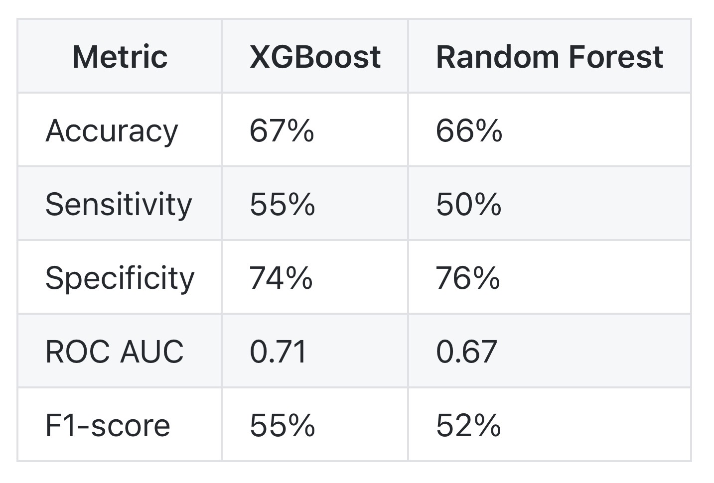

# Integration of Spatial Patterns and Machine Learning for Cholera Risk Assessment in Southern Ethiopia (PART 2)

## Predictive Modeling of Cholera Severity in Gedeo Zone, Ethiopia Using Machine Learning

This repository contains a Jupyter notebook that implements a machine learning pipeline to predict cholera severity based on individual-level epidemiological and clinical data from the Gedeo Zone. The notebook covers feature engineering, data preprocessing, hyperparameter tuning using Bayesian optimization, and model evaluation with XGBoost and Random Forest classifiers. The goal is to develop predictive models that support targeted   decision-making and improve surveillance efforts in cholera-affected settings.

## Overview

The notebook covers:

- Feature engineering from epidemiological and clinical cholera case data, including temporal and environmental variables.  
- Data preprocessing techniques, such as encoding categorical variables and scaling numerical features.  
- Handling class imbalance through the calculation of weighting parameters for model training.  
- Hyperparameter tuning of XGBoost using Bayesian optimization with cross-validation to improve the predictive performance.  
- Development and evaluation of predictive models, including XGBoost and Random Forest classifiers.  
- Model performance assessment using metrics such as accuracy, ROC AUC, precision, recall, F1-score, and confusion matrices.  
- Discussion of the model’s strengths, limitations, and potential applications in clinical decision support and public health surveillance.

This notebook enhances the analysis by developing data-driven solutions to identify severe cholera cases, thereby complementing the spatial and descriptive insights obtained from the previous exploratory phase.

## File Structure

- `ml_gedeo_cholera_f.ipynb` — Jupyter notebook containing the complete machine learning workflow for predicting cholera severity, including feature engineering, model training, hyperparameter tuning, and evaluation.  
- `ml_gedeo_cholera_modelresults.jpeg` — Graphical summary of model performance metrics such as accuracy, sensitivity, specificity, ROC AUC, and F1-score. Detailed explanations of these results are available within the notebook.

## How to Use

1. Clone or download the repository.
2. Install required Python libraries, including `pandas`, `xgboost`, `bayesian-optimization`, and others as listed in the notebook.
3. Run the notebook sequentially to reproduce the analyses.

## Graphical Summary

*Table 1: Summary of model performance metrics for XGBoost and Random Forest classifiers predicting cholera severity. Metrics include accuracy, sensitivity (recall), specificity, ROC AUC, and F1-score, illustrating comparative strengths and limitations of each model on the test dataset.*

## License

This project is licensed under the MIT License.

## Questions?
Should you have questions or feedback regarding this repository, feel free to send them in at jprmaulion[at]gmail[dot]com. Cheers!
